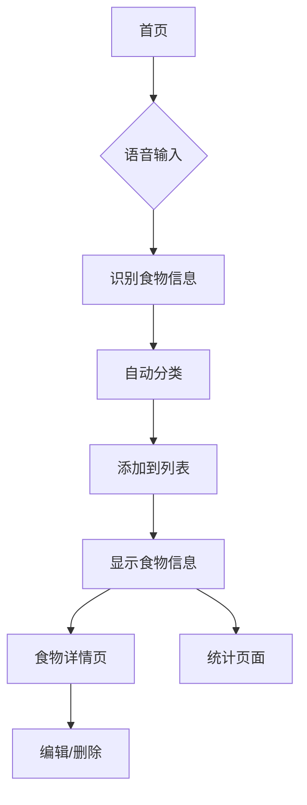

## 1. 产品概述
智能冰箱管家是一个基于Web的应用程序，旨在帮助用户通过语音识别技术轻松管理冰箱内的食物存储。用户可以通过语音输入食物信息，系统会自动识别并分类（海鲜、肉类、蔬菜、其他），同时记录入库时间，让食物管理更加智能化和便捷。

目标用户：家庭用户、注重食材管理的个人、追求智能生活的用户群体。

## 2. 核心功能

### 2.1 用户角色
| 角色 | 注册方式 | 核心权限 |
|------|----------|----------|
| 普通用户 | 邮箱注册 | 添加食物、查看库存、编辑食物信息、删除食物 |

### 2.2 功能模块
智能冰箱管家包含以下主要页面：
1. **首页**：语音输入、食物列表展示、分类筛选。
2. **食物详情页**：显示食物详细信息、编辑功能。
3. **统计页面**：食物分类统计、过期提醒。

### 2.3 页面详情
| 页面名称 | 模块名称 | 功能描述 |
|-----------|-------------|-------------|
| 首页 | 语音输入区 | 点击麦克风按钮开始语音识别，识别食物名称和数量，自动分类到对应类别（海鲜/肉类/蔬菜/其他）。 |
| 首页 | 食物列表 | 展示所有食物项目，包含食物名称、数量、分类图标、入库时间，支持按分类筛选显示。 |
| 首页 | 搜索栏 | 输入关键词搜索特定食物，支持模糊匹配。 |
| 食物详情页 | 信息展示 | 显示食物详细信息：名称、数量、分类、入库时间、过期时间（可选）。 |
| 食物详情页 | 编辑功能 | 修改食物名称、数量、分类，支持删除操作。 |
| 统计页面 | 分类统计 | 以图表形式展示各分类食物的数量分布。 |
| 统计页面 | 过期提醒 | 显示即将过期或已过期的食物列表。 |

## 3. 核心流程
用户操作流程：
1. 用户进入首页，点击语音输入按钮
2. 说出食物信息（如"3个苹果"）
3. 系统自动识别并分类到"蔬菜"类别
4. 食物显示在列表中，包含入库时间
5. 用户可以查看详情、编辑或删除食物

## 4. 用户界面设计

### 4.1 设计风格
- **主色调**：清新的绿色（#4CAF50）代表新鲜食材，辅以白色背景
- **按钮样式**：圆角矩形，带有阴影效果，悬停时有轻微放大动画
- **字体**：系统默认字体，标题16px，正文14px
- **布局风格**：卡片式布局，每个食物项目为一个独立卡片
- **图标风格**：使用简洁的线性图标，分类图标采用食物相关的emoji

### 4.2 页面设计概述
| 页面名称 | 模块名称 | UI元素 |
|-----------|-------------|-------------|
| 首页 | 语音输入区 | 中央放置大圆形麦克风按钮，点击时变为红色表示录音中，周围有波纹动画效果。 |
| 首页 | 食物列表 | 采用网格布局，每个食物卡片包含emoji图标、食物名称、数量、入库时间，背景为白色带圆角和阴影。 |
| 首页 | 分类筛选 | 顶部标签栏，包含全部、海鲜、肉类、蔬菜、其他五个选项，选中状态为绿色背景。 |
| 食物详情页 | 详情卡片 | 大卡片展示食物信息，底部有编辑和删除按钮，采用模态框形式。 |
| 统计页面 | 图表区域 | 使用饼图展示分类分布，下方列表显示过期提醒，使用橙色警告色。 |

### 4.3 响应式设计
采用桌面端优先的设计方案，确保在PC端有最佳体验。同时适配平板和手机端：
- 平板端：调整网格列数，保持功能完整性
- 手机端：采用单列布局，优化触摸交互，按钮尺寸适配手指操作

### 4.4 交互优化
- 语音识别时显示实时转文字结果
- 添加食物成功后有短暂的成功提示动画
- 删除操作需要二次确认
- 支持拖拽排序食物项目（可选功能）