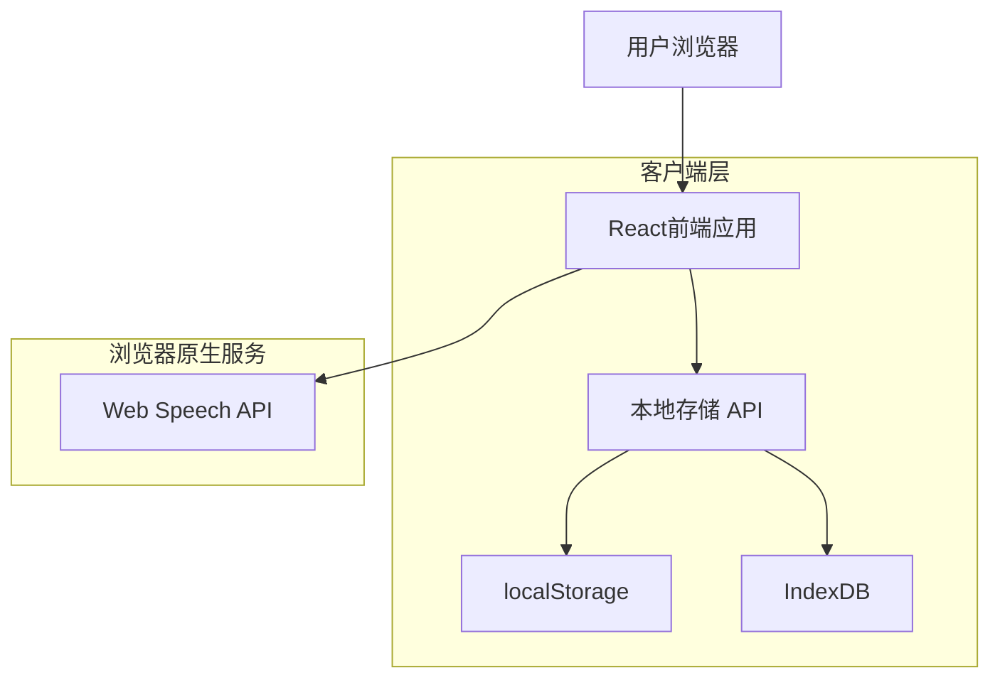

## 1. 架构设计



## 2. 技术描述

- **前端**: React@18 + TypeScript + TailwindCSS@3 + Vite
- **初始化工具**: vite-init
- **数据存储**: 浏览器本地存储 (localStorage + IndexDB)
- **语音识别**: Web Speech API (浏览器原生)
- **UI组件库**: Headless UI + 自定义组件
- **状态管理**: React Context + useReducer
- **图表库**: Chart.js (用于统计页面)

## 3. 路由定义

| 路由 | 用途 |
|-------|---------|
| / | 首页，显示语音输入和食物列表 |
| /item/:id | 食物详情页，显示和编辑食物信息 |
| /stats | 统计页面，显示分类统计和过期提醒 |

## 4. 数据模型

### 4.1 本地数据结构

```typescript
// 食物项目接口定义
interface FoodItem {
  id: string;
  name: string;
  quantity: number;
  category: 'seafood' | 'meat' | 'vegetable' | 'other';
  entryTime: string; // ISO日期字符串
  expiryTime?: string; // ISO日期字符串
  createdAt: string;
  updatedAt: string;
}

// 本地存储键名
const STORAGE_KEYS = {
  FOOD_ITEMS: 'intelligent_fridge_items',
  SETTINGS: 'intelligent_fridge_settings'
};
```

### 4.2 本地存储服务

```typescript
// 本地存储服务
class LocalStorageService {
  // 获取所有食物项目
  static getFoodItems(): FoodItem[] {
    const items = localStorage.getItem(STORAGE_KEYS.FOOD_ITEMS);
    return items ? JSON.parse(items) : [];
  }

  // 添加新食物项目
  static addFoodItem(item: Omit<FoodItem, 'id' | 'createdAt' | 'updatedAt'>): FoodItem {
    const newItem: FoodItem = {
      ...item,
      id: Date.now().toString(),
      createdAt: new Date().toISOString(),
      updatedAt: new Date().toISOString()
    };
    
    const items = this.getFoodItems();
    items.push(newItem);
    localStorage.setItem(STORAGE_KEYS.FOOD_ITEMS, JSON.stringify(items));
    
    return newItem;
  }

  // 更新食物项目
  static updateFoodItem(id: string, updates: Partial<FoodItem>): FoodItem | null {
    const items = this.getFoodItems();
    const index = items.findIndex(item => item.id === id);
    
    if (index === -1) return null;
    
    items[index] = {
      ...items[index],
      ...updates,
      updatedAt: new Date().toISOString()
    };
    
    localStorage.setItem(STORAGE_KEYS.FOOD_ITEMS, JSON.stringify(items));
    return items[index];
  }

  // 删除食物项目
  static deleteFoodItem(id: string): boolean {
    const items = this.getFoodItems();
    const filteredItems = items.filter(item => item.id !== id);
    
    if (filteredItems.length === items.length) return false;
    
    localStorage.setItem(STORAGE_KEYS.FOOD_ITEMS, JSON.stringify(filteredItems));
    return true;
  }

  // 清空所有数据
  static clearAllData(): void {
    localStorage.removeItem(STORAGE_KEYS.FOOD_ITEMS);
    localStorage.removeItem(STORAGE_KEYS.SETTINGS);
  }
}
```

## 5. 核心功能实现

### 5.1 语音识别集成
```typescript
// 使用Web Speech API进行语音识别
class SpeechRecognitionService {
  private recognition: SpeechRecognition;
  
  constructor() {
    const SpeechRecognition = window.SpeechRecognition || window.webkitSpeechRecognition;
    this.recognition = new SpeechRecognition();
    this.recognition.lang = 'zh-CN';
    this.recognition.continuous = false;
    this.recognition.interimResults = false;
  }

  startRecognition(onResult: (text: string) => void, onError: (error: string) => void): void {
    this.recognition.onresult = (event) => {
      const transcript = event.results[0][0].transcript;
      onResult(transcript);
    };

    this.recognition.onerror = (event) => {
      onError(event.error);
    };

    this.recognition.start();
  }

  stopRecognition(): void {
    this.recognition.stop();
  }
}
```

### 5.2 自动分类算法
```typescript
// 基于关键词的食物分类
const CATEGORY_KEYWORDS = {
  seafood: ['鱼', '虾', '蟹', '贝', '海鲜', '海带', '紫菜'],
  meat: ['肉', '鸡', '鸭', '牛', '羊', '猪', '火腿', '香肠'],
  vegetable: ['菜', '萝卜', '土豆', '番茄', '黄瓜', '白菜', '葱', '姜', '蒜']
} as const;

function classifyFood(foodName: string): FoodItem['category'] {
  for (const [category, keywords] of Object.entries(CATEGORY_KEYWORDS)) {
    if (keywords.some(keyword => foodName.includes(keyword))) {
      return category as FoodItem['category'];
    }
  }
  return 'other';
}

// 智能解析语音输入
function parseFoodInfo(text: string): { name: string; quantity: number } {
  // 简单的数量提取
  const quantityMatch = text.match(/(\d+)/);
  const quantity = quantityMatch ? parseInt(quantityMatch[1]) : 1;
  
  // 移除数量词，提取食物名称
  let name = text.replace(/\d+/g, '').replace(/[个只条包盒瓶]/g, '').trim();
  
  return { name, quantity };
}
```

### 5.3 数据导出/导入功能
```typescript
// 数据备份和恢复
class DataBackupService {
  // 导出数据为JSON文件
  static exportData(): void {
    const items = LocalStorageService.getFoodItems();
    const dataStr = JSON.stringify(items, null, 2);
    const dataBlob = new Blob([dataStr], { type: 'application/json' });
    
    const link = document.createElement('a');
    link.href = URL.createObjectURL(dataBlob);
    link.download = `fridge_backup_${new Date().toISOString().split('T')[0]}.json`;
    link.click();
  }

  // 从JSON文件导入数据
  static importData(file: File): Promise<void> {
    return new Promise((resolve, reject) => {
      const reader = new FileReader();
      reader.onload = (e) => {
        try {
          const items = JSON.parse(e.target?.result as string) as FoodItem[];
          localStorage.setItem(STORAGE_KEYS.FOOD_ITEMS, JSON.stringify(items));
          resolve();
        } catch (error) {
          reject(new Error('文件格式错误'));
        }
      };
      reader.readAsText(file);
    });
  }
}
```

## 6. 部署配置

### 6.1 环境变量
```bash
# .env文件
VITE_APP_NAME=Intelligent Fridge
VITE_APP_VERSION=1.0.0
```

### 6.2 构建配置
```json
// package.json
{
  "scripts": {
    "dev": "vite",
    "build": "vite build",
    "preview": "vite preview"
  }
}
```

### 6.3 PWA配置（可选）
```typescript
// vite.config.ts
import { VitePWA } from 'vite-plugin-pwa'

export default defineConfig({
  plugins: [
    VitePWA({
      registerType: 'autoUpdate',
      workbox: {
        globPatterns: ['**/*.{js,css,html,ico,png,svg}']
      },
      manifest: {
        name: '智能冰箱管家',
        short_name: '冰箱管家',
        description: '智能语音冰箱管理系统',
        theme_color: '#ffffff',
        icons: [
          {
            src: 'icon-192.png',
            sizes: '192x192',
            type: 'image/png'
          },
          {
            src: 'icon-512.png',
            sizes: '512x512',
            type: 'image/png'
          }
        ]
      }
    })
  ]
})
```